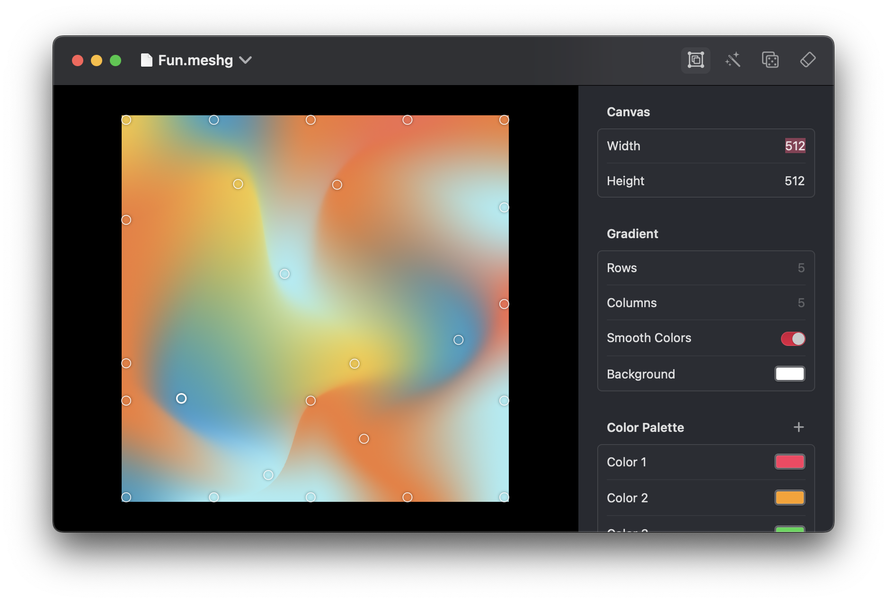

# MeshBuddy

A simple SwiftUI `MeshGradient` editor with the following features:

- [X] Setup mesh gradient with custom width, height, and canvas (image) size
- [X] Document-based app with undo/redo support for all operations
- [X] Edit individual points of the mesh gradient interactivelly
- [X] Set colors for individual points of the mesh, or distribute a color palette across the points
- [X] Drag and drop color palettes from [Pastel](https://apps.apple.com/us/app/pastel/id413897608)
- [X] Randomize mesh with perlin noise or pseudo-random generator
- [X] Image export
- [ ] Swift code generation

**Known Limitations:**

- The canvas will always fit to the size of the window, so if the canvas size is very large and the window is small, the control points can be difficult to manipulate (workaround: use a smaller canvas size and change it before exporting an image)
- Randomization features could be better, the results are not very interesting right now

